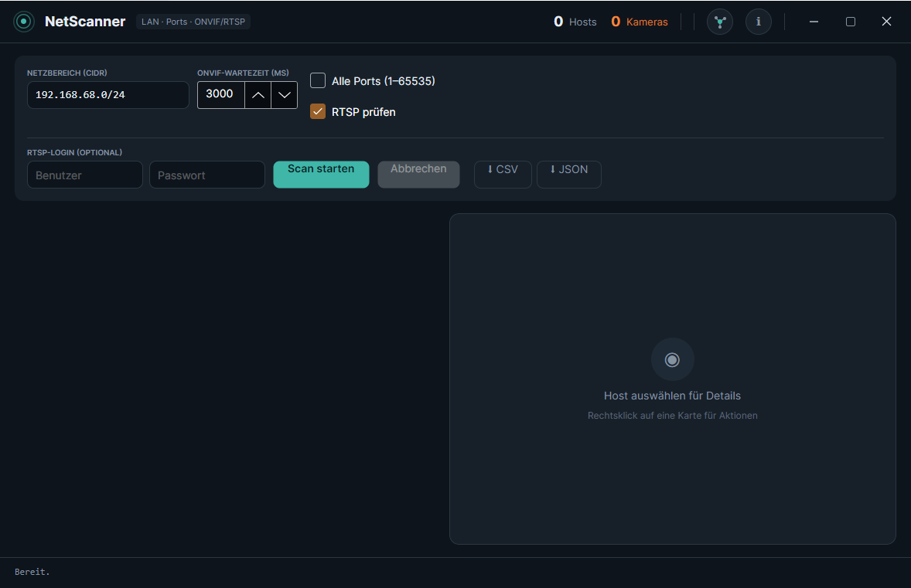
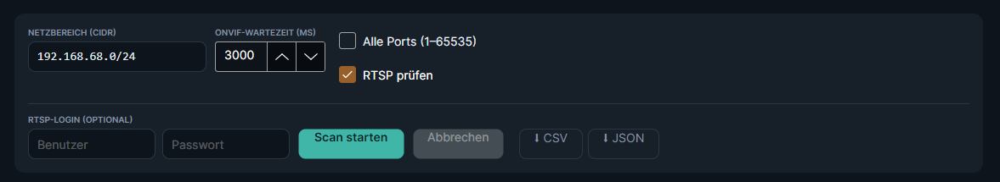
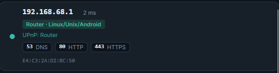
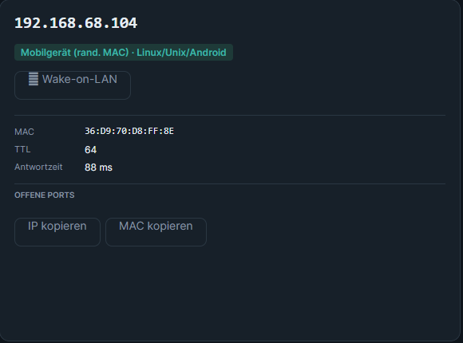
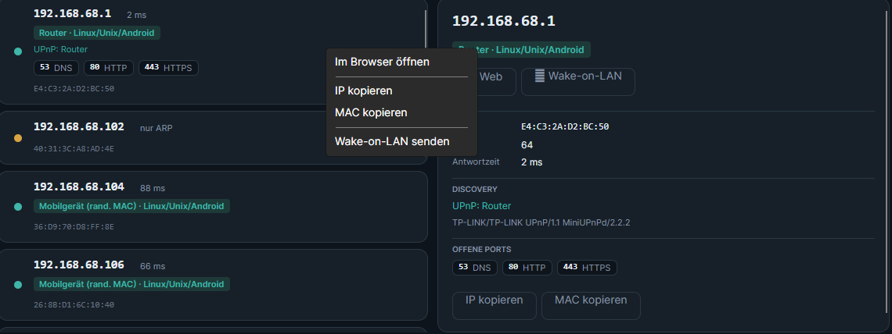
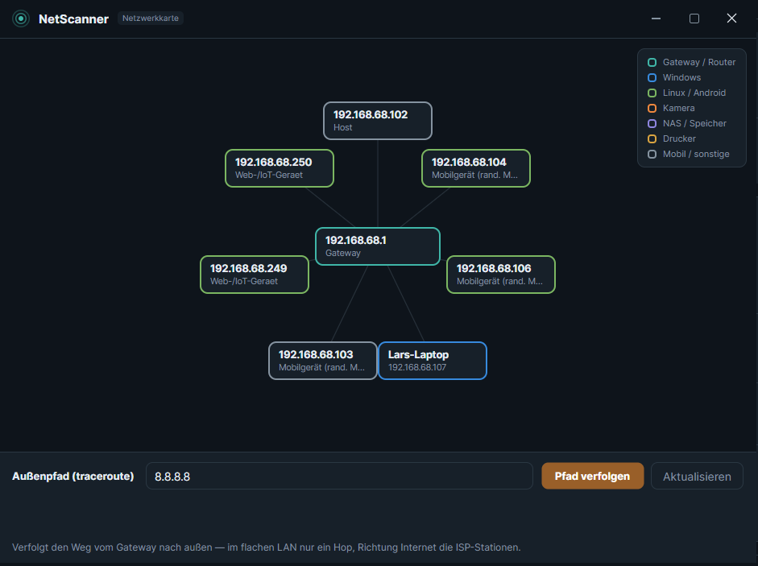
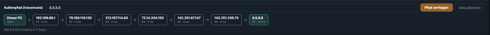

# NetScanner

**LAN-Discovery · Portscan · Geräte-Fingerprinting · ONVIF/RTSP-Kameraerkennung mit eingebettetem Live-Video — und eine interaktive Netzwerkkarte.**

Ein schlankes Desktop-Werkzeug, um das eigene Netz sichtbar zu machen: Welche Geräte sind online, was sind sie (Router, Drucker, NAS, Kamera, Handy …), welche Dienste bieten sie an — und wie kommt das Netz nach außen. Plattformübergreifend für **Windows** und **Linux**.

> .NET 10 (C# 14) · Avalonia 12 · LibVLCSharp (Core) · NLog · MVVM (CommunityToolkit)



---

## Inhalt

- [Was kann NetScanner?](#was-kann-netscanner)
- [Installation](#installation)
- [Handbuch](#handbuch)
  - [1. Das Hauptfenster](#1-das-hauptfenster)
  - [2. Scan konfigurieren und starten](#2-scan-konfigurieren-und-starten)
  - [3. Die Ergebnisliste lesen](#3-die-ergebnisliste-lesen)
  - [4. Detail-Panel](#4-detail-panel)
  - [5. Aktionen per Kontextmenü](#5-aktionen-per-kontextmenü)
  - [6. Kamera-Stream ansehen](#6-kamera-stream-ansehen)
  - [7. Ergebnisse exportieren](#7-ergebnisse-exportieren)
  - [8. Netzwerkkarte und Außenpfad](#8-netzwerkkarte-und-außenpfad)
- [Wie die Geräteerkennung funktioniert](#wie-die-geräteerkennung-funktioniert)
- [Plattform-Hinweise](#plattform-hinweise)
- [Logging](#logging)
- [Projektaufbau](#projektaufbau)
- [Bewusste Grenzen](#bewusste-grenzen)
- [Lizenz](#lizenz)

---

## Was kann NetScanner?

| Funktion | Beschreibung |
|---|---|
| **Discovery** | ICMP-Ping-Sweep über einen CIDR-Bereich, ergänzt um die ARP-/Neighbor-Tabelle. Auch Geräte, die auf Ping schweigen (Handys im Doze), aber per ARP, mDNS, SSDP oder ONVIF auftauchen, werden gelistet. |
| **Portscan** | Asynchroner TCP-Connect-Scan, gedrosselt über `SemaphoreSlim`. Wahlweise gängige Ports oder der volle Bereich 1–65535. |
| **Geräte- & OS-Fingerprinting** | Schätzt Gerätetyp (Router, Drucker, NAS, Kamera, Mobilgerät …) und OS-Familie aus TTL, offenen Ports, MAC-Hersteller (OUI) und Bannern. |
| **Namensauflösung** | Reverse-DNS, mDNS/Bonjour, NetBIOS und SSDP/UPnP — der beste verfügbare Name wird angezeigt. |
| **Kameraerkennung** | ONVIF-WS-Discovery + Port-Heuristik (554/8554) + RTSP-`OPTIONS`-Probe. Optional mit RTSP-Login für die Stream-URL. |
| **Live-Video** | RTSP-Stream direkt im Fenster, eingebettet über LibVLC (`NativeControlHost`). |
| **Host-Aktionen** | Pro Gerät: Weboberfläche öffnen, SSH, RDP, SMB-Freigabe, IP/MAC/Name kopieren, **Wake-on-LAN**. |
| **Export** | Ergebnisliste als **CSV** (Semikolon, Excel-DE) oder **JSON**. |
| **Netzwerkkarte** | Interaktive Stern-Topologie: Gateway im Zentrum, Geräte ringsum, eingefärbt nach Typ. |
| **Außenpfad (Traceroute)** | Verfolgt den Weg vom Gateway nach außen Richtung Internet — ICMP mit ansteigender TTL, ohne externes Tool. |
| **Audit-Logging** | Zwei getrennte Logs (alles / nur Benutzereingaben). Passwörter werden nie geloggt. |

---

## Installation

### Fertige Releases (empfohlen)

Über die [Releases](../../releases)-Seite gibt es vorgebaute Pakete (vom GitHub-Actions-Workflow erzeugt):

- **Windows (empfohlen):** `NetScanner-…-Setup.exe` — Installer mit Startmenü-Eintrag. Er bringt die **.NET 10 Desktop Runtime mit** und installiert sie bei Bedarf automatisch; ist sie schon vorhanden, wird dieser Schritt übersprungen. libvlc ist enthalten.
- **Windows (portabel):** `NetScanner-…-win-x64.zip` — entpacken, `NetScanner.exe` starten. Dieses Paket ist framework-dependent, setzt also eine installierte **.NET 10 Desktop Runtime** voraus (sonst startet die App nicht).
- **Linux:** `NetScanner-…-linux-x64.tar.gz` **oder** `NetScanner-…-x86_64.AppImage`.
  libvlc ist hier eine **Laufzeit-Abhängigkeit** (siehe unten).

### Aus dem Quellcode bauen

```bash
git clone https://github.com/Kroste/NetzwerkScan.git
cd NetzwerkScan
dotnet restore
dotnet run
```

Voraussetzung: **.NET 10 SDK** (≥ 10.0.300, in `global.json` gepinnt).

### libvlc (für das Kamera-Video)

- **Windows:** kommt automatisch über das NuGet `VideoLAN.LibVLC.Windows` — nichts zu tun.
- **Linux:** die System-libvlc installieren. Auf immutable Fedora/Bazzite gehört das **in den `dotnet10`-Distrobox-Container**, nicht aufs Host-System:
  ```bash
  sudo dnf install vlc-libs      # Fedora: liefert libvlc.so + Plugins
  # Debian/Ubuntu:  sudo apt install libvlc-dev vlc-plugin-base
  ```
  `Core.Initialize()` findet die System-libvlc dann automatisch. Discovery, Portscan und die Netzwerkkarte funktionieren auch **ohne** libvlc — nur das eingebettete Video bleibt dann schwarz.

---

## Handbuch

### 1. Das Hauptfenster

Oben die Titelleiste mit Live-Zählern (**Hosts** / **Kameras**), dem Button für die **Netzwerkkarte** und dem **„i“**-Button (Über-Dialog). Darunter der Eingabebereich, links die scrollbare Ergebnisliste, rechts das Detail-Panel mit dem Videobereich.


### 2. Scan konfigurieren und starten



- **Netzbereich (CIDR):** z. B. `192.168.68.0/24`. Beim Start ist dein lokales Subnetz vorausgewählt.
- **ONVIF-Wartezeit (ms):** wie lange auf ONVIF-Antworten gewartet wird. Höher = mehr Kameras gefunden, aber langsamer.
- **Alle Ports (1–65535):** aus = nur ein kuratierter Satz gängiger Ports (schnell); an = vollständiger Scan (deutlich langsamer).
- **RTSP prüfen:** aktiviert die RTSP-`OPTIONS`-Probe zur Kamerabestätigung.
- **RTSP-Login (optional):** Benutzer/Passwort für Kameras, die für die Stream-URL Authentifizierung verlangen. Das Passwort wird **nicht** geloggt.

Mit **Scan starten** beginnt der Lauf; Ergebnisse erscheinen **streamend**, du musst nicht aufs Ende warten. **Abbrechen** stoppt sauber.

### 3. Die Ergebnisliste lesen

Jedes Gerät ist eine Karte. So liest du sie:



- **IP + Latenz** oben (`2 ms`, oder „nur ARP“, wenn das Gerät nicht auf Ping antwortet).
- **Typ-Badge** wie `Router · Linux/Unix` oder `Web-/IoT-Gerät · Windows` — die geschätzte Kombination aus Gerätetyp und OS.
- **Statuspunkt:** grün = per ICMP erreichbar, gelb = nur per ARP gesehen.
- **Discovery-Zeile:** Klartext aus mDNS/SSDP/NetBIOS, z. B. `UPnP: Router` oder gefundene Dienste.
- **Bester Name:** DNS- > mDNS- > NetBIOS-Name, falls vorhanden.
- **Banner-Zeile:** z. B. `HTTP: Microsoft-IIS/10.0` oder das SSH-Banner.
- **Port-Chips:** offene Ports mit Dienstnamen (`80 HTTP`, `443 HTTPS`, `139 NetBIOS`, `445 SMB` …).
- **MAC-Adresse** unten, inkl. Erkennung randomisierter MACs (→ „Mobilgerät“).

### 4. Detail-Panel

Ein Klick auf eine Karte zeigt rechts alle Informationen gebündelt und die passenden **Aktions-Buttons**. Bei einer aktiven Kamera erscheint darunter das Video.



### 5. Aktionen per Kontextmenü

**Rechtsklick** auf eine Karte öffnet das Kontextmenü. Es zeigt nur, was zum Gerät passt:



| Aktion | Sichtbar wenn | Verhalten |
|---|---|---|
| **Im Browser öffnen** | Port 80/443/8080/8443 offen | Öffnet die Weboberfläche (HTTPS bevorzugt) |
| **SSH** | Port 22 offen | Windows: startet `ssh`; Linux/macOS: kopiert den Befehl |
| **RDP** | Port 3389 offen | Windows: `mstsc`; sonst ausgeblendet |
| **SMB-Freigabe** | Port 139/445 offen | Windows: `\\IP` im Explorer; sonst `smb://IP` |
| **IP / MAC / Name kopieren** | immer / wenn vorhanden | In die Zwischenablage |
| **Wake-on-LAN** | MAC bekannt | Sendet ein Magic-Packet (UDP-Broadcast) |

### 6. Kamera-Stream ansehen

Bei erkannten Kameras zeigt das Detail-Panel die **RTSP-URL** und einen Button **„Stream öffnen“**. Das Video läuft eingebettet im Fenster.


> Falls eine Kamera für den Stream Zugangsdaten verlangt, trag sie vor dem Scan unter **RTSP-Login** ein. NetScanner rät **keine** Passwörter.

### 7. Ergebnisse exportieren

Über die Export-Buttons sicherst du die komplette Hostliste:

- **CSV** — semikolongetrennt, passend für deutsches Excel.
- **JSON** — strukturiert, für Weiterverarbeitung/Skripte.

### 8. Netzwerkkarte und Außenpfad

Der Knoten-Button oben im Header öffnet die **Netzwerkkarte** in einem eigenen Fenster (nicht-modal — du kannst parallel weiterscannen).



- **Stern-Topologie:** das **Gateway** im Zentrum (ermittelt aus dem Default-Gateway, ersatzweise dem per UPnP erkannten Router), alle anderen Geräte ringsum.
- **Farbe = Gerätetyp** (siehe Legende oben rechts).
- **Klick auf einen Knoten** wählt das Gerät aus — das Detail-Panel im Hauptfenster springt sofort mit.
- **Aktualisieren** zeichnet die Karte aus dem aktuellen Scan neu.

Unten die Leiste **Außenpfad (traceroute):** Ziel eingeben (Standard `8.8.8.8`, leer = Gateway) und **Pfad verfolgen** — die Hops erscheinen live als Kette „Dieser PC → … → Ziel“.



> Im flachen LAN ist der Weg zum Gateway genau **ein Hop** — Switches und Access-Points sind auf IP-Ebene unsichtbar. Interessant wird die Kette mit einem Internet-Ziel oder über Subnetzgrenzen hinweg.

---

## Wie die Geräteerkennung funktioniert

NetScanner kombiniert mehrere Signale zu einer Einschätzung — bewusst ohne Raw-Sockets, also **ohne erhöhte Rechte**:

| Signal | Quelle | Beispiel |
|---|---|---|
| **TTL** | ICMP-Reply | ≤64 → Linux/Unix/Android, ≤128 → Windows, höher → Netzwerkgerät |
| **Offene Ports** | TCP-Connect | 3389 → Windows, 22 → Linux, 9100/515/631 → Drucker, 5000/5001 → NAS, 62078 → iPhone |
| **MAC-Hersteller** | OUI-Lookup | Hersteller aus den ersten 3 MAC-Oktetten; gesetztes Locally-Administered-Bit → randomisierte (mobile) MAC |
| **mDNS/Bonjour** | Multicast 224.0.0.251:5353 | Chromecast, AirPlay, Drucker, Sonos, HomeKit … |
| **NetBIOS** | UDP 137 | Windows-/Samba-Name + Arbeitsgruppe |
| **SSDP/UPnP** | Multicast 239.255.255.250:1900 | Router, Media-Server, Smart-TV (aus dem `SERVER`-Header) |
| **Banner** | HTTP-`HEAD` / SSH-Handshake | `Microsoft-IIS/10.0`, `nginx`, `OpenSSH_9.6` |

Hohe Konfidenz haben dabei UPnP-Typ und mDNS-Dienste; TTL/Ports/OUI ergänzen das Bild.

---

## Plattform-Hinweise

- **Avalonia 12 + Video:** Es wird bewusst **nicht** `LibVLCSharp.Avalonia` verwendet (das hängt an Avalonia 11). Stattdessen reicht `NativeVideoView` LibVLC direkt das native Fenster-Handle. Sobald das offizielle Paket auf 12 nachzieht, lässt sich `NativeVideoView` dagegen tauschen.
- **Wayland (KDE Plasma auf Bazzite):** Native-Embedding läuft am stabilsten unter **X11/XWayland**. Avalonia nutzt unter Linux standardmäßig den X11-Backend; das `XID`-Handle funktioniert dann auch unter Wayland. Bleibt das Video schwarz, App testweise mit erzwungenem X11 starten.
- **ONVIF-Multicast & Firewall:** WS-Discovery braucht ausgehenden UDP-Multicast auf Port 3702. In restriktiven Netzen kann das blockiert sein — die Port-Heuristik (554/8554) greift dann weiterhin.
- **Traceroute unter Linux:** Die Hop-IPs sind unter **Windows** zuverlässig. Unter Linux liefert der unprivilegierte ICMP-Socket die Adresse des antwortenden Routers bei TTL-Ablauf nicht immer zurück — dann erscheint `* * *` statt der Hop-IP. Die Stern-Karte selbst ist davon nicht betroffen.
- **Mehrere Interfaces:** Sweep und WS-Discovery laufen pro aktivem IPv4-Interface.

---

## Logging

Konfiguration in `nlog.config` (wird neben die EXE kopiert, `autoReload`).
Zielordner: `%AppData%/NetScanner/logs` (Windows) bzw. `~/.config/NetScanner/logs` (Linux).

- `netscanner-<datum>.log` — **alle Schritte** (Debug+).
- `userinput-<datum>.log` — **nur Benutzereingaben** (Logger `UserInput`): Scan-Start mit Parametern, Abbruch, Stream-Öffnen, Feldänderungen.
- **Passwörter werden nie geloggt**; RTSP-Credentials in URLs werden maskiert.

---

## Projektaufbau

| Schicht | Datei(en) | Aufgabe |
|---|---|---|
| Discovery | `Services/NetworkScanner.cs` | ICMP-Ping-Sweep (kein Raw-Socket), streamend |
| ARP/OUI | `Services/ArpResolver.cs`, `Services/OuiLookup.cs` | MAC-Auflösung + Herstellererkennung |
| Portscan | `Services/PortScanner.cs` | async TCP-Connect, gedrosselt via `SemaphoreSlim` |
| Fingerprinting | `Services/DeviceClassifier.cs`, `Services/BannerGrabber.cs` | Typ/OS aus TTL, Ports, OUI, Bannern |
| Discovery-Protokolle | `Services/MdnsDiscovery.cs`, `Services/NetBiosProbe.cs`, `Services/SsdpDiscovery.cs` | mDNS / NetBIOS / SSDP |
| ONVIF/RTSP | `Services/OnvifDiscovery.cs`, `Services/RtspProbe.cs` | WS-Discovery + RTSP-Probe |
| Wake-on-LAN | `Services/WolSender.cs` | Magic-Packet (UDP-Broadcast) |
| Traceroute | `Services/TracerouteService.cs` | ICMP mit ansteigender TTL |
| Orchestrierung | `Services/ScanOrchestrator.cs` | führt alles zusammen, klassifiziert Kameras |
| Video | `Controls/NativeVideoView.cs` | LibVLC in Avalonia 12 via `NativeControlHost` |
| UI/State | `ViewModels/MainViewModel.cs`, `Views/*.axaml` | MVVM, Audit-Logging, Netzwerkkarte |

---

## Bewusste Grenzen

- **TCP-Connect-Scan statt SYN-Scan** — kein Raw-Socket, daher keine erhöhten Rechte nötig (und kein nmap-genaues OS-Fingerprinting).
- **Kein Passwort-Raten.** ONVIF-`GetStreamUri`/RTSP-Credentials gibst du selbst an — gedacht für Geräte im **eigenen** Netz.
- **Traceroute zeigt keine LAN-Topologie**, sondern nur den Pfad nach außen — innerhalb eines Subnetzes gibt es keine Hops.

---

## Lizenz

© Kroste. Nutzung im eigenen Netz. Siehe Repository für Details.

*NetScanner ist ein privates Werkzeug zur Inventarisierung des eigenen Netzwerks. Scanne nur Netze, für die du autorisiert bist.*
